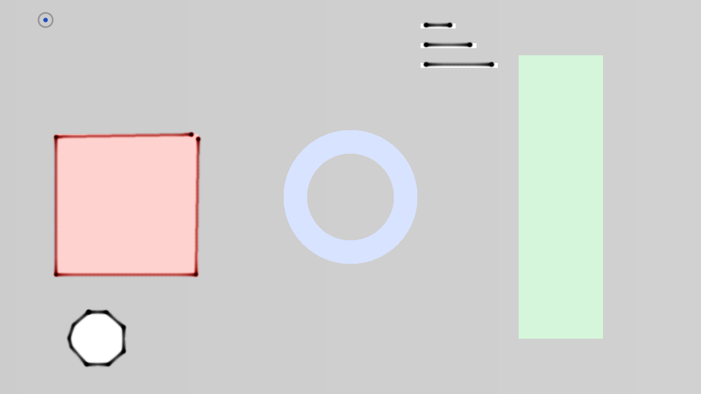
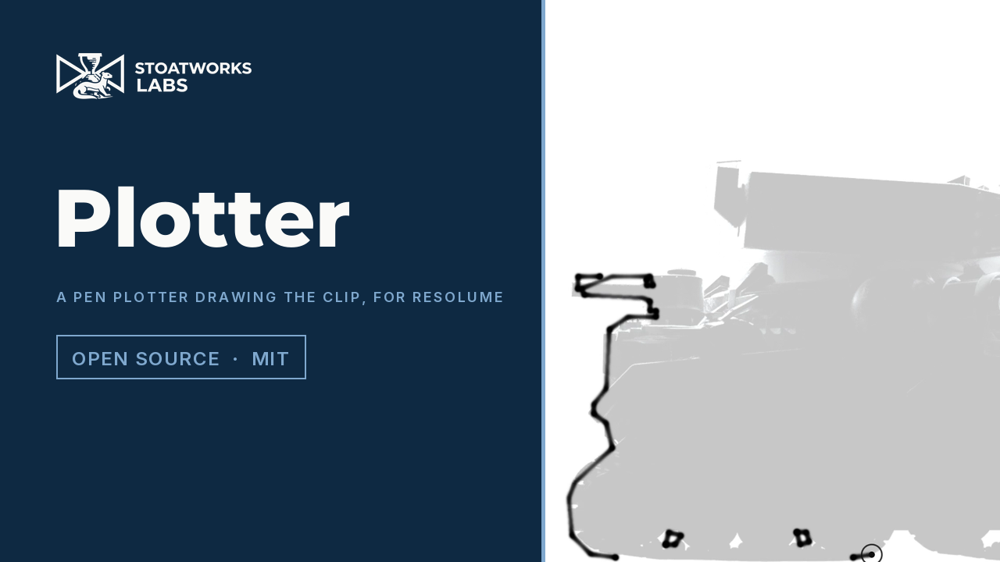

# plotter

> **AI-assisted project.** This codebase was created with [Claude](https://claude.com/claude-code)
> (Anthropic), directed and reviewed by a human author. The machine is
> verified numerically by an offline harness that drives the real plugin
> class on a synthetic clock: a stroke's timing against the trapezoid's
> closed form, the ink along it against 1/speed, the strokes on the sheet
> after t seconds against the planned schedule, a staircase against the step
> pitch, pen changes against the pen count, and the sheet through a resize
> — and every one of those checks is proved to fail on a deliberately broken
> plugin (see [Status](#status)). It has **never been loaded into Resolume on
> macOS**; on Windows it has run in Resolume Arena 7.27.1, on software rendering.
> Check it in your own rig before trusting it in front of an audience.

A pen plotter drawing the clip, as an FFGL effect for [Resolume](https://resolume.com)
Arena and Avenue. It traces the outlines in the current frame and draws
them with a slow pen — a speed limit, an acceleration limit, a lift and a
drop between strokes, a trip to the carousel to change colour — onto paper
the ink stays on. By the time it is a few strokes in, the clip has moved on.

The repo's test card after twelve seconds at the defaults, rendered by
`pltest`, the offline harness. The corners are heavier than the sides and
every stroke starts and ends with a blot — neither is drawn.

<!-- downloads:start -->

## Download

**[v0.1.0](https://github.com/stoatworks-labs/plotter/releases/tag/v0.1.0)** — prebuilt for macOS and Windows. Pick your platform:

<b>macOS</b> — Universal (Apple Silicon + Intel)

| Build | Download | Size |
| --- | --- | --- |
| Universal (Apple Silicon + Intel) · .dmg disk image | [`plotter-0.1.0-macos-universal.dmg`](https://github.com/stoatworks-labs/plotter/releases/download/v0.1.0/plotter-0.1.0-macos-universal.dmg) | 484 KB |
| Universal (Apple Silicon + Intel) · .zip archive | [`plotter-macos-universal.zip`](https://github.com/stoatworks-labs/plotter/releases/latest/download/plotter-macos-universal.zip) | 201 KB |

<b>Windows</b> — x64

| Build | Download | Size |
| --- | --- | --- |
| x64 · .exe installer | [`plotter-0.1.0-windows-x86_64-setup.exe`](https://github.com/stoatworks-labs/plotter/releases/download/v0.1.0/plotter-0.1.0-windows-x86_64-setup.exe) | 238 KB |
| x64 · .zip archive | [`plotter-windows-x86_64.zip`](https://github.com/stoatworks-labs/plotter/releases/latest/download/plotter-windows-x86_64.zip) | 133 KB |

All builds, checksums and release notes: [github.com/stoatworks-labs/plotter/releases](https://github.com/stoatworks-labs/plotter/releases).

The Windows builds are unsigned, so SmartScreen warns once.

<!-- downloads:end -->

## Video

## The one idea

[galvo](https://github.com/stoatworks-labs/galvo) is a laser: a fast mirror
redrawing the whole path every frame. A plotter is **the opposite machine.
It is slow**, and the ink stays.

Everything anybody recognises about a plotter drawing falls out of that:

- **Fast content never gets finished.** The pen takes the path from the frame
  on screen when it asks for work, and works through it at its own pace. The
  sheet is a collage of the moments at which each stroke was drawn. `Chase`
  re-traces at the end of every stroke, so the next one always comes from now.
- **Ink weight follows speed.** The pen deposits ink per unit of *time*, so the
  line is heavy where the pen is slow — the ends of every stroke, every
  corner — and thin on the straights. Turn `Max Speed` down and the whole
  drawing darkens; turn `Acceleration` down and the heavy ends grow.
- **A blot at every pen-down.** `Pen Settle` is how long the pen rests on the
  paper before it moves and after it stops. It is a dot of ink, and it is why
  a plotter drawing is dotted at every vertex the pen lifted at.
- **Stair-stepping.** Two stepper motors can only stop on a grid. Wind `Step
  Size` up and a shallow diagonal is drawn as runs and risers, exactly `k`
  steps by one for a slope of `1/k`.
- **Pen changes cost time.** With a carousel of `Pens`, the driver sorts the
  strokes by pen the way real plotter drivers did (`Optimise`), and every
  change is a trip off the corner of the sheet and a wait.

None of it is drawn. There is a trapezoidal motion planner, a machine that
advances by the time that really passed, and a renderer that spreads each
interval's ink over the distance the carriage covered in it. The blots, the
heavy corners and the staircases are what those three do.

## Controls

- **Machine** — `Max Speed` (0.05–2 sheet heights a second), `Acceleration`,
  `Pen Settle` (the blot), `Step Size` (off, then a stepper pitch from half a
  pixel to a staircase), `Corner Angle` (a turn this sharp is a full stop; a
  gentler one is taken slower in proportion).
- **Pens** — `Pens` (1–8 on the carousel), `Pen Width`, `Flow` (the darkness
  at the reference speed, whatever the width), `Palette` (Technical, Black,
  Neon, or Source — the stroke's own colour sorted onto the technical pens),
  `Optimise` (sort by pen, then nearest start).
- **Path** — `Threshold` and `Detail`, galvo's tracer controls with galvo's
  names; `Chase`.
- **Sheet** — `Auto Sheet` (tear off after N seconds; 0 never), `New Sheet`
  (tear off now), `Paper` (White, Cream, Ghost — the clip faintly under the
  sheet, Clip, or Alpha for the layer below), `Show Carriage`, `Show Travel`
  (pen-up moves as a faint pencil line), `Mix`.

The tracer is galvo's, copied rather than rewritten: it thins a thresholded
edge mask and walks it. On logos and line art it finds long clean strokes;
on footage it finds a mess of short ones, which is the honest result of
pointing a plotter at video and is the look.

## Status

**v0.1.0, and honestly early.** Verified by measurement on an M4 Max,
macOS 26.4, 2026-09-24. Every check runs at 320×180 and 1280×720; every
tolerance is derived and written down in [AGENTS.md](AGENTS.md).

| Check | Result |
| --- | --- |
| Trapezoid timing | a 0.6-height stroke at v = 0.3, a = 0.5 takes **2.7998 s** of pen-down time by the ink on the sheet against 2.8000 predicted (L/v + v/a + two settles); a 0.02-height stroke **0.6000 s** against 0.6000 (2√(L/a)); frame-counted to within one frame |
| Ink follows 1/v | where the speed is half cruise the column density is **2.018×** the middle's against 2.0125 predicted, both ends, tolerance 2% |
| Budget | five bars, 17.68 s of job: at every checkpoint the finished bars, the inked length of the current one and the untouched ones match the closed-form schedule to σ + 1 px |
| Staircase | slope 1/6 at a pitch of 18 px: every run on its level to 0.001 px, risers 0.150 apart (k·p) to 0.33 px; the straight line is 1.75 px away |
| Pen changes | 8 strokes over 4 pens: **4** trips to the carousel with Optimise, 8 without, every stroke in its pen's colour to 0.00% |
| Persistence | 30 idle frames leave the sheet byte for byte; a resize to 2× reproduces the bilinear blend of the old texels at 464,456 inked texels, worst 1.2e-7; New Sheet clears to exactly nothing |
| End to end | a filled square through the plugin's own detect passes is one closed black stroke of perimeter 1.3047 against 1.3333 (±8%), and is drawn on the sheet |
| Negative controls | all six checks **fail** on their perturbed plugin: infinite acceleration, a job every frame, no quantisation, no pen sorting, a resize that clears |
| Mutation | `-0.5` → `-0.6` in the nib's Gaussian: caught by `--trapezoid` at both rasters (−8.8% against 1%) |
| No dead controls | all **19** swept parameters measurably change the picture |
| In an FFGL host | `oxbow` reports `SW Plotter` / `PL01` / `effect`, instantiates it and renders 120 frames |
| Binary | universal (`x86_64 arm64`), exports `plugMain`, ad-hoc signs |
| Render cost | **0.19–0.21 / 0.20–0.22 / 0.53 ms** a frame at 720p / 1080p / 4K as shipped (the tracer runs once a job); **0.73–1.69 / 0.77–2.05 / 1.15 ms** with a trace forced every frame, of which the tracer — readback, trace, plan — is 0.59–1.44 / 0.64–1.72 / 0.98 ms. Ranges over two runs on a shared GPU: the readback stall is what moves |

**Not yet done:** never loaded into Resolume on macOS. On Windows, in Resolume Arena 7.27.1 (win-lab, Mesa llvmpipe, no GPU, 2026-09-24), the DLL of this source loads from Extra Effects, registers as `SW Plotter` / `PL01` / effect, all 25 host controls match the declaration, it renders, Arena's log stays clean and all 19 controls move the picture: 9 of the fleet gate's 9 checks, in two runs (before and after the tear-off fix). Software rendering says nothing about a GPU or about speed.
Footage has been seen through `pltest --pipe` only (the project video, on
Resolume's bundled demo clips): on a dark ground the Source palette is a dark
pen, because the stroke's colour is sampled at the edge, against the
background. No OpenFX port, no factory presets. There is a
[user guide](https://stoatworks-labs.com/software/plotter/guide/) and a
[browser demo](https://plotter-demo.stoatworks-labs.com/), which is a port to a web page and
not the plugin. See [AGENTS.md](AGENTS.md) for what is assumed rather than
measured, the traps, and the open questions.

## Browser demo

[plotter-demo.stoatworks-labs.com](https://plotter-demo.stoatworks-labs.com/)
runs the plugin's own shaders in WebGL2 — the detect chain, the ink pass
assembled from the same three pieces, the composite — copied across unedited
and checked character for character by `demo/tools/check_shaders.py` from
`tools/verify.sh`. Its CPU half — galvo's tracer, the planner, the machine
advancing by real elapsed time, the paper's bookkeeping — is a **hand port to
JavaScript**, and nothing checks a port but a reader. The page says so in its
banner and lists every other gap (RGBA8 stabilise buffers, a 16F paper where
the browser has no `EXT_float_blend`, Pens as a dropdown, New Sheet as a
button) in its disclosure. It is served from `demo/` by this repo's own
Worker and redeploys on every push to main.

## Build

    git clone --recursive https://github.com/stoatworks-labs/plotter
    cmake -B build -DCMAKE_BUILD_TYPE=Release
    cmake --build build
    cmake --install build          # into Resolume's Extra Effects

C++17 + GLSL 4.10, CMake, FFGL 2.1 (SDK vendored as a submodule). macOS
builds are universal (arm64 + x86_64) by default; add
`-DCMAKE_OSX_ARCHITECTURES=arm64` for a faster development build. Windows
needs GLEW via vcpkg.

## Building and testing

The offline harness drives the real plugin class headlessly on a synthetic
clock. The planner and the machine are plain C++ and need no GPU.

    ./build/pltest --out /tmp/frame.png     the test card, drawn
    ./build/pltest --plan                   the planner and the machine (no GL)
    ./build/pltest --trapezoid              a stroke takes L/v + v/a
    ./build/pltest --ink                    ink follows 1/v
    ./build/pltest --budget                 the strokes drawn by t seconds
    ./build/pltest --steps                  the staircase
    ./build/pltest --pens                   pen changes
    ./build/pltest --persist                the sheet, and a resize
    ./build/pltest --trace                  through the detect passes
    ./build/pltest --negative               every check can fail
    ./build/pltest --bench                  720p and 1080p
    python3 tools/sweep.py                  no control is silently dead
    tools/verify.sh                         all of it, plus a real host load

<!-- attributions:start -->
This project is built on other people's work — see [ATTRIBUTIONS.md](ATTRIBUTIONS.md).
<!-- attributions:end -->

## Licence

MIT — see [LICENSE](LICENSE).
